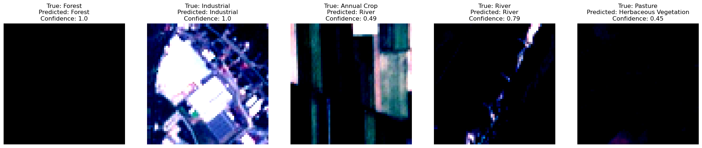

# Satellite Image Classification with CNNs 🛰️

## Technologies 💻
**Language:** Python

**Libraries:** PyTorch, NumPy, Matplotlib, scikit-learn, torchvision

## Overview ⚡

This project explores image classification using Convolutional Neural Networks (CNNs) applied to satellite imagery from the EuroSAT dataset. The objective is to classify RGB satellite images into 10 distinct land-use categories including residential areas, forests, rivers, highways, and agricultural land.

Three CNN architectures were developed and evaluated, including multiple dropout regularisation strategies, to investigate the impact of architectural design choices on model performance and generalisation.

## Dataset 📈

[EuroSAT Satellite Imagery with Labels](https://www.kaggle.com/datasets/apollo2506/eurosat-dataset)

## Features 🧬

- CNN implemented from scratch using PyTorch
- Multiple architecture experiments
- Dropout regularisation analysis
- Training and validation loss visualisation
- Confusion matrix evaluation
- Prediction visualisation tool

## Example Prediction Visualisation 🏞️

